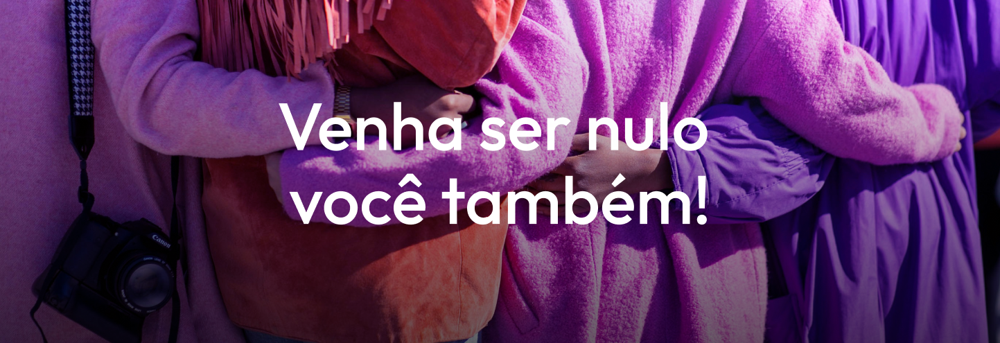

# Nullbank

> Este projeto foi criado como um desafio do Programa de bolsas da empresa Compass Uol, visando aprimorar habilidades técnicas no desenvolvimento Front end com a criação de um site do banco digital Nullbank

### Requisitos do projeto

O projeto foi desenvolvido conforme os requisitos solicitados pela empresa, porém futuramente poderão ser desenvolvidas as demais páginas do site.

#### Requisitos obrigatórios

- [x] Utilizar apenas HTML, CSS e JS. Não podendo usar bibliotecas externas
- [x] Os campos de formulário devem ser todos validados com **JavaScript**, isso é válido para todos os campos, não utilizar a validação do HTML.
- [x] Armazene os dados do formulário no LocalStorage.
- [x] Os botões devem levar para pagina de 404
- [x] Criação de uma tela de erro, caso o usuário se depare com um erro ao navegar no projeto.
- [x] Crie um repositório privado em seu Github e adicione os instrutores como colaboradores do projeto;
- [x] Adicione um README ao seu projeto;
- [x] Faça pequenos commits e use Convencionais Commits para manter seu repositório organizado.

#### Requisitos opcionais

- [x] Aplicar efeitos de Hover;
- [x] Aplicar  responsividade ao projeto;
- [x] Mensagem de confirmação ao enviar os dados do formulário corretamente.

## 🖥️ Sobre o site

O site possui informações sobre o banco digital Nullbank, benefícios, serviços prestados, um formulário para entrar em contato e convida o usuário para baixar o aplicativo e abrir sua conta.

## 📷 Interface

https://github.com/user-attachments/assets/9fb7b283-3146-4d7d-9919-4fb9c8540249

## 🛠️ Ferramentas

#### O projeto foi desenvolvido utilizando apenas a famosa tríade do fontend

- ###  HTML
- ###  CSS 
- ###  Javascrip
- Não foram utilizadas bibliotecas ou frameworks

## ✏️ Aprendizados e Desafios

Este projeto foi uma excelente oportunidade para aprimorar habilidades no desenvolvimento Web, como a manipulação do DOM com Javascript e a aplicação de responsividade com CSS flexbox.

Dentre os principais desafios estão a validação do formulário apanas com Javascript e a criação de um menu sanduíche sem a utilização de bibliotecas, o que contribuiu para o aperfeiçoamento com a linguagem JS.

## 🙏 Agradecimentos

Agradeço aos instrutores do Programa de Bolsas pelo suporte e também a Compass pela oportunidade de fazer parte do programa.
